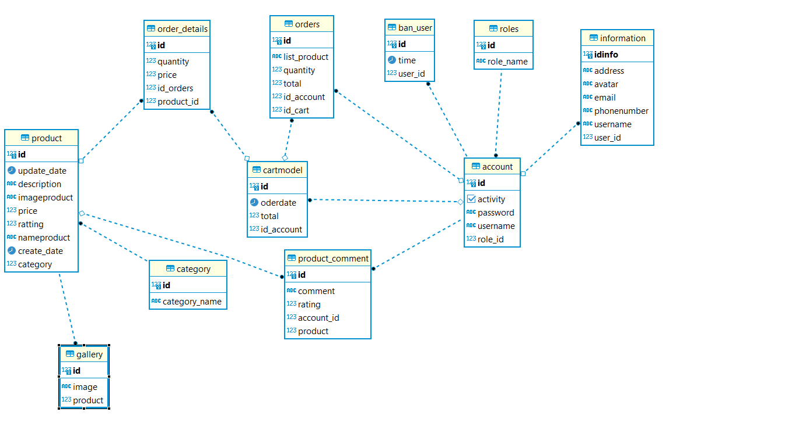

# Ecommerce-Rookies-B5
# Database

hiện tại entity ban_user em chưa dùng tới

- Cart model là entity khi mỗi account tạo ra thì sẽ có 1 giỏ hàng cố định những giỏ hàng đó sẽ chứa những sản phẩm trước khi check out
- Orders Là sau khi người dùng check out giỏ hàng thì tất cả dữ liệu sẽ được đổ qua bên orders và sẽ làm mới hoàn toàn lại cart đồng thời những oderdetails sau khi check out của giỏ hàng đó cũng sẽ được xóa
- Product hiện tại table gallery chưa dùng dó em chỉ lưu 1 image ( vẫn có thể lưu nhiều image nhưng UI ko dùng tới)
- category sẽ chứa list product nếu xóa 1 category thì đồng thời cũng xóa tất cả product chứa trong category đó
- Account 2 Role chính là admin , user dó 2 luồng đập lập nên admin sẽ không bao gồm tất cả tính năng của user
- Account của user sẽ được admin khóa bằng update lại activity
- Thông tin user sẽ được người dùng cập nhật trong phần profile khi đăng ký thành công , có thể tùy chỉnh sửa thông tin ( nhưng ko cập nhật pass , name)
- Hiện tại em đang lưu trên localStorage nên sẽ không hợp lí vì thực tế sễ tấn công nhưng do thời gian có hạn nên đó là cách em đẩy nhanh nhất
- Admin xóa được product ( khi admin xóa tất cả liên quan tới product đó cũng sẽ bị mất)
# Các nguồn tham khảo đồ án
- https://mdbootstrap.com/docs/ ( UI bootstrap )
- stackoverflow ( fix bux)
- Nguồn từ document được cung cấp từ mentor
# UI chính sẽ có trong đêm nay 

# Đây là cừa hàng bán áo quần nhưng là over size nhé :V
#Thanks mn : ĐINH TRỌNG KHÁNH 
